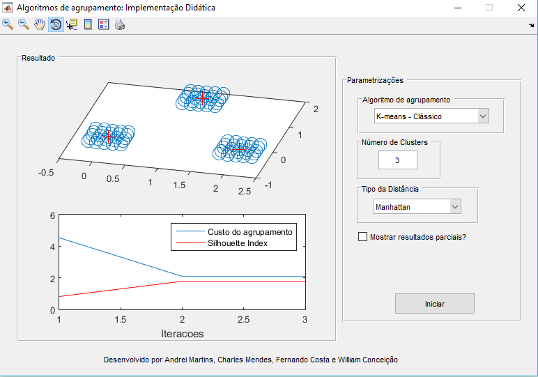
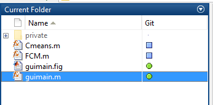
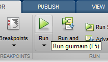
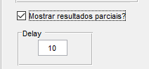
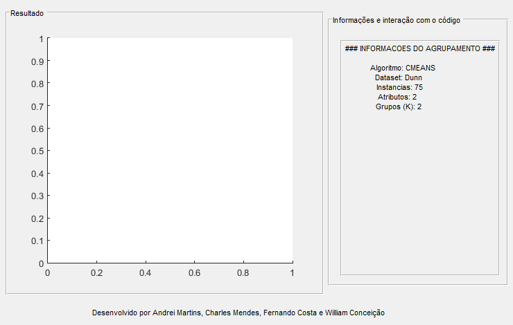
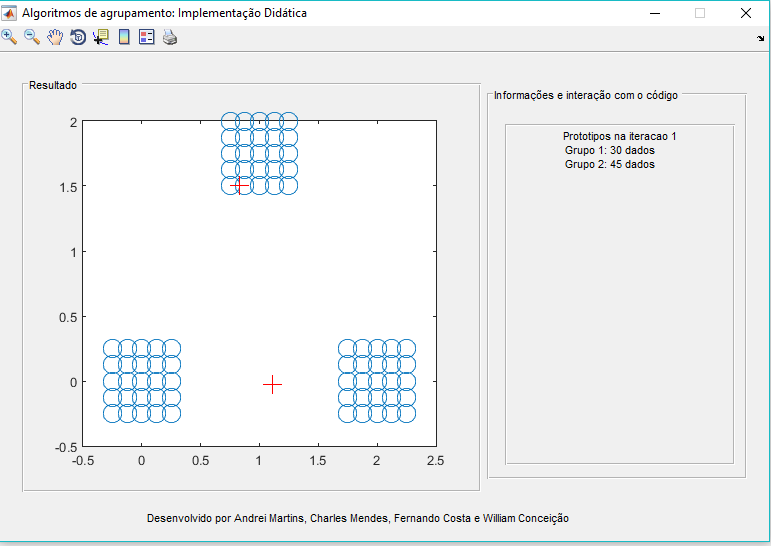
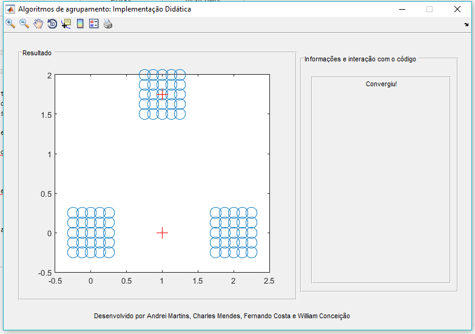

# Trabalho da disciplina de Aprendizado de Máquina
## PPgSI - USP EACH

## Algoritmos implementados: K-Means e Fuzzy K-means.
Ano: 2º/2016

---------------------------------------

Foi desenvolvido utilizando a ferramenta MatLab, com a implementação de Interface Gráfica do Usuário (GUI). 

## Carregando a Interface Gráfica do Usuário (GUI)

Após ter feito o download do código, abra os arquivos pelo Matlab. 
Em seguida, abra o arquivo **guimain.m** indicado abaixo: 

E clique no botão **Run** ou pressione **F5**, como indicado na imagem abaixo: 

Assim, vai abrir a Interface Gráfica do Usuário para utilizar e interagir com as implementações realizadas neste trabalho. 

## Modo de uso

Com a interface gráfica aberta, é possível interagir com a implementação realizada, de forma intuitiva. 

No painel de **Parametrização** é possível selecionar os parâmetros dos algoritmos: 

- Selecionar quais dos dois algoritmos deseja executar (K-means ou Fuzzy);
- Informar o número de agrupamento (k); 
- Selecionar o tipo da distância (Manhattan ou Euclideana); 
- Fator de Fuzzy **quando for selecionado o Fuzzy**;

Conforme é possível vê na imagem abaixo: 

**K-means Clássico**

** Fuzzy K-means **

E para deixar ainda mais didático a interação com o código implementado, foi incluído o **"Mostrar resultados parciais?"**. Caso seja selecionado, vai aparecer o campo de "Delay" para incluir o tempo (segundos) que vai demora em cada passo.

Botão indicando que vai ser feito apresentação passo a passo: 

Informações: 

Desta forma, as informações vão ser ilustradas passo a passo no gráfico (feito com o K-means clássico): 

Desenvolvido por Andrei Martins, Charles Mendes, Fernando Costa e William Conceição.
